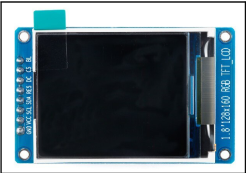
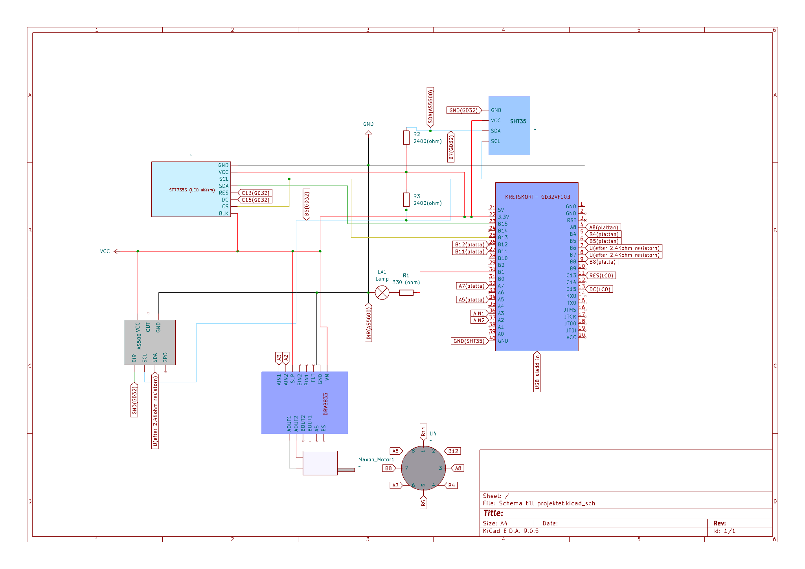
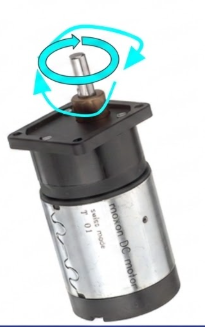
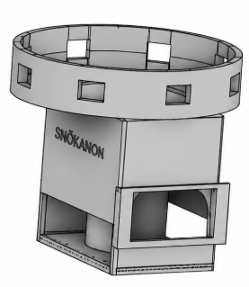
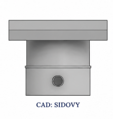
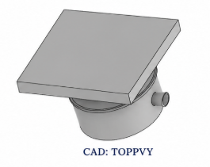
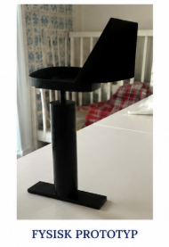

# Automated Snow Cannon Control Systems

## About
Second year electrical engineering project - General purpose 4 load power monitor ( based on RPi zero 2W and GD32VF103 on logan nano board )

---

## Overview
This project presents an automated control system for snow cannons designed to optimize production and mitigate operational risks[cite: 2]. By integrating real-time environmental monitoring of wind direction, temperature, and humidity, the system ensures snow is produced only under viable conditions (wet-bulb $<-2^{\circ}C$) and ensures the cannon is correctly positioned to prevent icing and waste[cite: 2].

---

## Firmware
The firmware is developed for the GD32VF103 (RISC-V) microcontroller and utilizes a modular architecture to separate low-level I2C hardware communication from high-level application logic[cite: 2].

* **Environmental Sampling:** The MCU interfaces with an SHT35 sensor via I2C to capture raw 16-bit temperature and humidity values[cite: 2].
* **Data Conversion:** Raw sensor data is converted into physical units ($^{\circ}C$ and %RH) using fixed-point arithmetic to calculate the current wet-bulb temperature[cite: 2].
* **Rotary Feedback Loop:** The system polls the AS5600 12-bit magnetic encoder via I2C (Register 0x0C) to obtain a raw value (0-4095), which is then mapped to a $0^{\circ}-359^{\circ}$ directional value[cite: 2].
* **PWM Motor Control:** Based on wind direction logic, the MCU generates PWM signals via `T1setPWMchx` to a DRV8833 H-bridge to drive the Maxon DC motor[cite: 2].
* **Position Verification:** A hardware feedback mechanism using 8 metal plates and a GPIO-linked probe (`GPIO_PIN_11`) allows the firmware to verify the physical orientation of the cannon against the target wind angle[cite: 2].

---

## Software
* **Environmental Monitoring:** Constantly polls the SHT35 sensor for real-time climate data[cite: 2].
* **Directional Logic:** Interprets data from the AS5600 wind sensor to calculate the necessary rotation for the cannon[cite: 2].
* **User Feedback:** Outputs current status and environmental data to an ST7735 LCD screen[cite: 2].

  

---

## Hardware

  
   
  <em>Kicad which shows how the Microcontroller is connected to the DC-motor and the LCD.</em>[cite: 2]

  
   
  <em>Picture of the maxon DC motor</em>[cite: 2]

---

## 3D-Design

  
  

  <em>Design prototype Holistic perspective &nbsp;&nbsp;&nbsp;&nbsp;&nbsp;&nbsp;&nbsp;&nbsp;&nbsp;&nbsp;&nbsp;&nbsp;&nbsp;&nbsp;&nbsp;&nbsp;&nbsp;&nbsp;&nbsp;&nbsp; Design prototype: Side view (CAD: SIDOVY)</em>[cite: 2]

  
  

  <em>Design prototype: Top view (CAD: TOPPVY) &nbsp;&nbsp;&nbsp;&nbsp;&nbsp;&nbsp;&nbsp;&nbsp;&nbsp;&nbsp;&nbsp;&nbsp;&nbsp;&nbsp;&nbsp;&nbsp;&nbsp;&nbsp;&nbsp;&nbsp; Design: Physical prototype (FYSISK PROTOTYP)</em>[cite: 2]

---

## Specifications (what is capable)
The graph below illustrates the operational tolerances of our snow cannon, calculated using our specific formula and SHT35 sensor readings[cite: 2].

| Temp ($^{\circ}C$) | 20% | 30% | 40% | 50% | 60% | 70% | 80% | 90% | 100% |
| :---: | :---: | :---: | :---: | :---: | :---: | :---: | :---: | :---: | :---: |
| **-8** | -10.0 | -10.3 | -10.5 | 10.4 | -10.2 | -9.8 | -9.4 | -8.8 | 8.2 |
| **-6** | -8.6 | -8.8 | -8.8 | -8.7 | -8.4 | -7.9 | -7.4 | -6.8 | -6.2 |
| **-4** | -7.3 | -7.3 | -7.2 | -6.9 | -6.6 | -6.1 | -5.5 | -4.9 | -4.2 |
| **-2** | -5.9 | -5.8 | -5.6 | -5.2 | -4.8 | -4.2 | -3.6 | -2.9 | -2.1 |
| **-0** | -4.5 | -4.3 | -3.9 | -3.5 | -3.0 | -2.4 | -1.7 | -0.9 | -0.1 |
| **+2** | -3.2 | -2.8 | -2.3 | -1.8 | -1.2 | -0.5 | 0.2 | 1.0 | 1.9 |
| **+4** | -1.8 | -1.3 | -0.7 | -0.1 | 0.6 | 1.4 | 2.2 | 3.0 | 3.9 |

> **Operational Status Key:** Excellent ($<-8^{\circ}C$), Good (-8 to $-5^{\circ}C$), Marginal (-5 to $-2^{\circ}C$), Unrunnable ($>-2^{\circ}C$)[cite: 2]

---

## Acknowledgements
This project was made possible because of Kim Örnberg's experience with snow cannons because of his earlier job, he recognized a problem and came up with a solution[cite: 2].

---

## Contributors
This was a course project which everyone took part in[cite: 2]. While the following roles denote primary responsibilities, all team members participated in design, review, and collaborative problem-solving[cite: 2].

* **George Pliatsikas Malinis (GR1king):** SHT35 sensor integration, technical specifications, and user manual[cite: 2].
* **Heorhii Bielkin:** SHT35 sensor integration and software development[cite: 2].
* **Kim Örnberg:** AS5600 sensor integration and 3D design for the wind-flag[cite: 2].
* **Abel Kibrom:** AS5600 software implementation, hardware integration[cite: 2].
* **Maddiba Thoma Saho:** DC motor 3D design for the complete prototype, hardware assembly[cite: 2].
